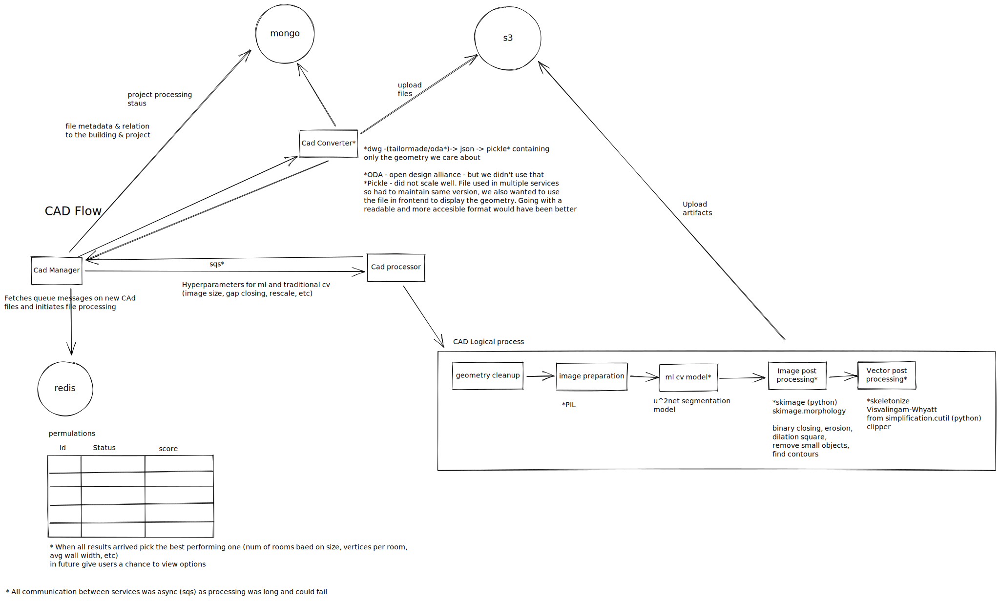
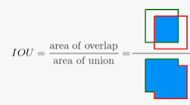

# CAD

## Production system

Also openfaas and serverless to use GPU on demand

## Testing system

We had ±150 plans that had ground truth information and we ran regression tests on algo changes.

When we were running just geometrical heuristics algorithms then all of the files were used to determine the processing hyperparameters and regressions testing was done on all files.

later on when ml was introduced there was a 100 / 50 splitbetween training and testing. The testing was increased synthetically by augmenting the plans - take partial plans and rotating.

Tests checked for 2 things - running time (various stages and overall) and results.

### Results

Basically we ran a subset of the production application in a special <i>mode</i> where some operations happened that did not happen in production, namely things like decorators for logging time and saving additional artifacts for the various stages (for instance images of various parts of the algorithm and uploading them to s3).

In order to run things in parallel we had a docker compose setup to raise an environment in the cloud and process many files in parallel.

To keep things very simple, we saved results in a folder on s3 - artifacts such as images for visual comparison and a json for numerial comparison.

We realized that there are complexities to the regressions testing - a change in the algorithm could 
improve some results and make other results worse off, more than that, the definition of better/ worse was not deterministic so the numerical data gave us hints on where to look so we could visually compare 
results frmo various runs. We wroet a small frontend app with an option to broswe runs and visually and numerically compare the same stages of a plan from various runs.

this gave us better tools to more quickly iterate over code without fearing regression.

Initially and for a very long time the measurement was IOU per room and then precision and recall to aggregate.

But sometimes in building simulations and visualizations small manual changes could be
very easy even if the shape is off, whereas there are some things that are visually 
similar but problematic such as misaligned walls and many vertices that don't match.

Later we experimented with chamfer matching and Hausdorff distance to take into account actual edges and vertices. Basically it's a known problem, distance between two sets of points. 

# simulation orchestration

Let's say a user has a simulation and now they change something in the inputs (let's say a security system simulation and the user moved a camera or changed a camera model).

We wanted to orchestrate the running of the simulations.

The idea was first to organize all the building elements in a graph with different layers 
of systems. We had the base system which was the building and on top of that other systems
such as security cameras and access control. 

If a camera looks at a door and a smart lock is defined on a door - when we change a door we need to trigger multiple simulations. More than that, a simulation for a system comprises of many sub components and we wanted to orchestrate between then and reuse commom functionality.

For that we switched to a pipleline orchestrator - argo which runs functions as pods on k8s
and handles the synchronization, errors, global context and complex DAGs.

Had problems relating to latency as had to wait for pods schedueling, switched to aws step functions, at first using lambdas but latency was still an issue, then to running services 
with rest as an api but had problems with local debugging using aws's api gateway (had to use it with step functions) and ended up using sqs to communicate between the services
that were always up.

# User Simulator & visualizor
(frontend app)

Main points here were how to support undo/redo - by saving diffs on the graph and the applying in reverse.

Synchronization of state and UI - source of truth was a serializable class and UI (s3 and 2d) would subscribe to specific fields in the class and using proxies get notifications on changes and react to those (using mobx).

geom representation and libs - draw/ edit rooms, split rooms, find closest point to mouse,
efficient rendering. This was all done using Three.js.

Raycasting for hovers on correct objects and the whole idea of integrating dashboards/panels with a 3D model (using three.js)

Snapping using aabb tree. 

Running simulations in the app - some simulations were quick and ra nin the browser, had a garph and than a draft, update the draft and only when in finishes update the original graph and save results to the backend.

# A specific system (smart locks)
there were several working systems in the time that I left, 

- Security cameras simulations
- Access Control
- Simplified fire system 

I was involved in the latter two 

Pull out the repos and see what happens there