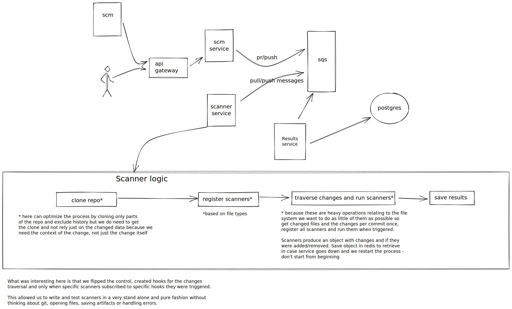

# Challenges at work
19.6.19

I’ve been wanting to write this for a while now. Having worked at Datree for some time I had this feeling that I’m not doing anything really. Like, working very hard, but what are the problems we’re actually trying to solve?
Moving data from one place to another, saving it, retrieving it and displaying it, that’s pretty much it I thought, and that’s kind of boring. If I go interview at a company now and they ask, what sort of challenges did you have/ solve at your company, what could I say?
And also for myself, are there any challenges at work? On the one hand, in the day to day we come across a lot of challenges, on the other hand we’re not trying to solve this big complex problem. 

So this is a retrospect of my time at the company, in a way it’s taking out the languages, frameworks and tooling and really think about the types of things I’ve been trying to solve.
I think that I need to be very deliberate on this question from now on, not try to answer it after I've been in a place for a long time but understand what i’m working on while i’m doing it, and also examine if the challenges I face are the types of challenges I actually want to work on.
If they’re not or if I don’t find any challenges worth writing about, I should not stay.

So, work.

## Microservices, ci/cd, aws (the little I do know)
How to develop small, goal oriented distributed systems that can support fast and frequent deployments. Before I was working either on small POC projects or client side applications where frequent deployments and auto scaling were not the pain point. Working with tools such as travis and aws, and with a small project footprint (for node using koa) and fort the front end projects react (often create react app) making a new project doesn’t have to be a big problem. Having many smaller projects is a pain in the ass at times but it does allow for decoupling of logic and scaling according to the service and how its used. 
The communication between the services was done using rest, at the beginning I thought it’s just a way to pass data around, not even that, took it completely for granted but as time passed I started seeing value in it, having a clear api makes it much easier to develop.
Next time I would prefer using something like grpc, of course depending on the languages.

## node eco system (npm, linters, transpilers)
before I came here, when it came to node the objective was to get things running. I never knew how complicated and vast this world is. Understanding how to set up a project, defining the environment, configuring all the things around the actual code for the project to work. This is not trivial - once a project is set up there’s not to much to do but it’s an important skill to have, just being able to navigate oneself in this world.

## Loading states (and more in general all different states) in a FE app
I think this problem revealed itself really early on and is probably one of the problems I was thinking about most during my time at the company, and my perspective on it changed a lot. For the longest time I just ignored the problem, dismissed it as boring or stupid and hacked my way through, as time passed I started thinking about it as a real issue and how to solve it. It took me a really long time to understand how this differs from loading states in a backend app where you await for something, maybe wrap it in a try catch and that's it while in the front end there’s a bunch of mechanisms (especially for us, working with react and redux) for keeping the state. My conclusions were that in the front end app we often don’t know what the user will do and we want to keep the user updated with every state that we happen to have. So user could click on any number of buttons, leading to async operations, and they could do it concurrently (more or less) so it’s not that our app has a state, it’s that every part of it can have a different state. The ui is not loading, the ui is always deterministic - that is showing a spinner, this is really different from loading. So in a way it’s distributed and not centered and we want to be really informative. This problem gets more complicated if for instance we load a list of items and then can change just one item, or relead that one item, and then another element within that item. 
I never really solved it in a really clean way though we had some working versions. 

Regarding all different states, also something I dismissed for a long time. Designers often prepare a mockup of an ideal state but besides that there’s an error state (or multiple ones depending on the error), empty state, not loaded state, too little data, too much data, really long or really short data. Thinking about these edge cases while preparing mockups and building the layout really influence the way you design the system. 

## Data consistency between back and front
being naive and trusting backend is a problem, especially when working with js. Typescript might have helped, what I did is take all the data that we get from the backend and pass it through adapters, even when I did not change the format I made sure it is what I expect. Typescript would have helped with throwing errors where we get the data and not when trying to render, but we’d still need something to adapt that data. So - trust outside source as little as possible. 

## Data container
abstract loading, displaying, sorting and filtering data of all types -  
 

## Custom code components and rules

we have a bunch of data from different domains and we want to run policies on it. The whole process of figuring out a general enough way to store the data -  key value, json (we went with key value) for it to be a generic base for custom rules. 

So we want flexibility such that every person can write their own file extractors and every person can write their own custom rules. Figuring out what’s shared and how to make the process of writing each rule and each extractor pure requires preprocessing, figuring out what each resource needs and creating a general flow in the background to which extractors and rules connect.

## Datree system design

